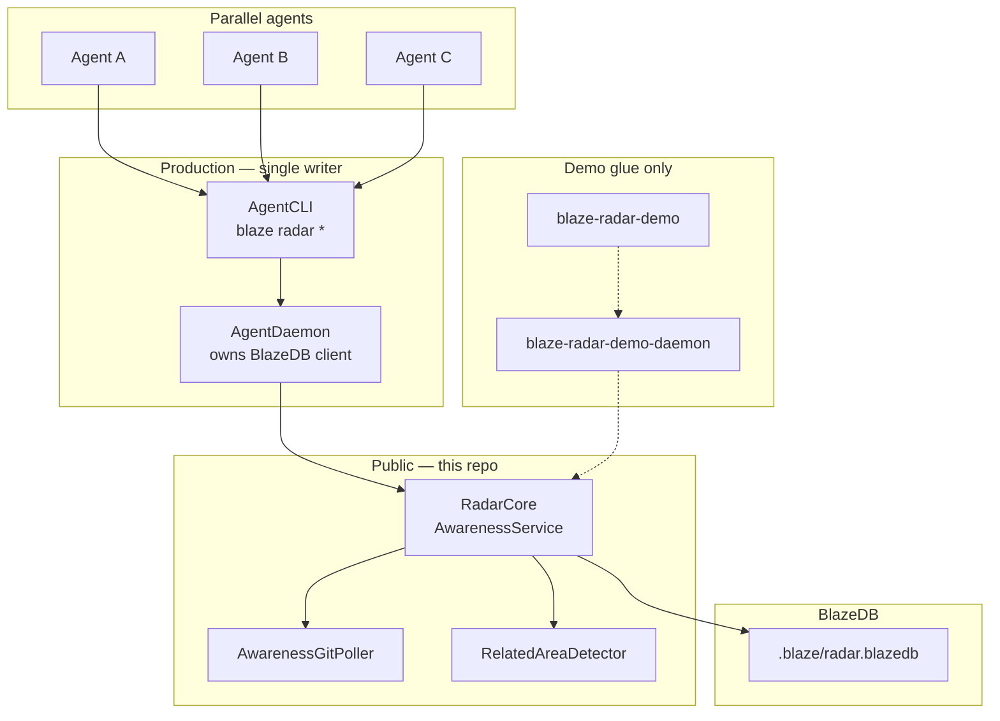
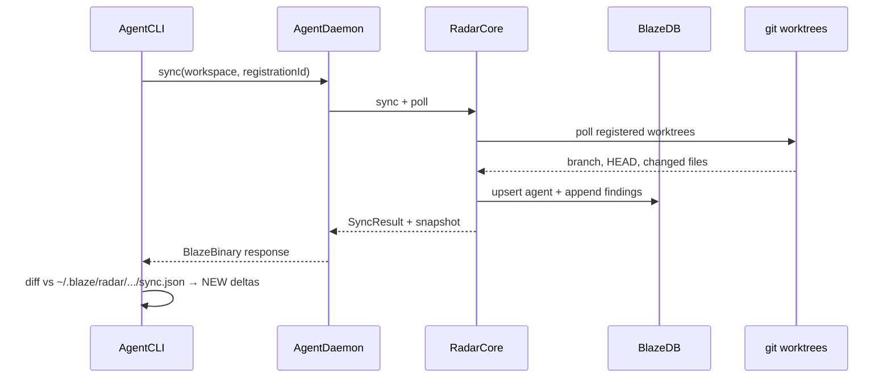

# Blaze Radar

**A BlazeDB-backed coordination layer for parallel AI coding agents.** (v0.2)

When you run multiple Claude/Cursor agents across git worktrees, nobody knows what anyone else is doing. Blaze Radar is the team whiteboard — not a project manager, not a merge bot, not Skynet. Just observability so agents stop duplicating each other's investigations.

```
Engineer walks in  → checks the standup board
Engineer learns    → updates the board
Next engineer      → avoids redoing the same discovery
```

> **This repo ships `RadarCore`** — the awareness module (coordination *logic*). **AgentDaemon** (private) is the canonical *host* — the long-lived process that owns the BlazeDB writer. A minimal demo daemon exists for contributors who lack AgentDaemon.

### Two layers — don't mix them

| Layer | What it is | This repo |
|-------|------------|-----------|
| **Coordination logic** | Shared state, concurrency safety, history, "who's doing what?", "what did they learn?" | **`RadarCore`** — the product |
| **Coordination process** | One long-lived owner of the DB connection, background git polling, heartbeats, stable API | **AgentDaemon** — the host |

The minimum architecture that solves parallel-agent awareness:

```
Claude / Cursor agents
        ↓
   shared interface
        ↓
    RadarCore
        ↓
     BlazeDB
```

That can work. BlazeDB already handles the scary part (durable, serialized writes). The reason ProjectBlaze puts AgentDaemon in front:

```
Agents → AgentDaemon → RadarCore → BlazeDB
              ↑
    single BlazeDB writer
    background GitObserver
    stable `blaze radar sync` API
```

BlazeDB is built around **one writer, serialized mutations, many reads**. AgentDaemon is the serialization boundary — like an app server in front of Postgres. It is not the radar algorithm. It keeps the lights on.

### Production architecture

```
AgentCLI          blaze radar register | sync | update | done
    ↓
AgentDaemon       host process (private) — owns BlazeDB client, runs poller
    ↓
RadarCore         awareness module (this repo — public)
    ↓
BlazeDB           durable coordination store
```

See [docs/AGENT_DAEMON_INTEGRATION.md](docs/AGENT_DAEMON_INTEGRATION.md) for wiring RadarCore into AgentDaemon.

### Optional demo stack (not canonical)

```
blaze-radar-demo  →  blaze-radar-demo-daemon  →  RadarCore  →  BlazeDB
```

The demo daemon is **not** the product. It exists because outsiders don't have AgentDaemon. Same pattern: one process owns writes, agents talk to a socket. Tiny digital janitor with a socket.

### Ownership model (the core invariant)

**Shared** (workspace / BlazeDB — what is true globally):

- Active board — who is working on what
- Findings — discoveries, ruled-out hypotheses, learnings
- Git observations — polled branch/HEAD/changed files
- Workspace registry — which repos the poller watches

**Private** (per agent — under `~/.blaze/radar/`):

- **Identity** — `session.json` (agent id, name, workspace)
- **Sync cursor** — `sync.json` (what *this* agent has already seen)

```
your-repo/.blaze/
  radar.blazedb                 ← shared truth (BlazeDB)

~/.blaze/radar/workspaces/{hash}/agents/{agentId}/
  session.json                  ← who am I?
  sync.json                     ← what have I seen?
```

Multiple agents on the same monorepo share one board. Each agent keeps its own nametag and read position. Claude A and Claude B no longer stomp each other's session files.

`blaze radar register --agent Claude` **resumes** an existing session for that name. Use `--new` to force a fresh registration.

---

## What this is not

Blaze Radar does **not** make agents share a brain. It gives them the same situational awareness human engineers get from standups, PRs, and Slack.

People will misunderstand this. Blaze Radar is:

| It is | It is not |
|-------|-----------|
| A team whiteboard | A project manager |
| Situational awareness | A shared mind / hive consciousness |
| Pull-based observation | Push notifications or autopilot |
| "Look around before duplicating work" | Scheduling, assignment, or ownership claims |
| Awareness only | Scheduling, assignment, or merge automation |

**The actual product metric:** Did Agent B learn what Agent A discovered *before* spending three hours on the same investigation?

The scheduler collision that motivated this wasn't a code-generation failure. Both agents wrote good code. The failure was that they didn't know they were coworkers. That's the bug Blaze Radar patches.

**Adoption reality:** Radar only works if agents actually use it. `blaze radar sync` needs to become muscle memory — every 15 minutes or before changing approach. If agents ignore it, you get that one Confluence page nobody has updated since 2019, but in Markdown.

**Longer term (not v1):** MCP integration could lower the "remember to run a shell command" problem — auto-register on session start, a tool call to check radar, auto-update on discoveries. Not because MCP is magically smarter, but because it removes friction.

---

## The problem

Running 4–6 agents in parallel on one monorepo fails in predictable ways:

| Failure | What happens |
|---------|--------------|
| **Duplicate discovery** | Agent B spends 3 hours rediscovering what Agent A already found |
| **Concept collisions** | Same underlying system, different files — file-level locks don't help |
| **Tunnel vision** | Agent checks radar at T+0, pivots at T+30, never looks again |
| **Integration blindness** | Nobody knows what's landing on `main` (out of scope for v1) |

The human was the only shared memory. That doesn't scale.

---

## What Blaze Radar fixes

**Core invariant:** If Agent A learns something important, Agent B can discover it *before* duplicating the work.

Blaze Radar gives you:

- **Registration** — agents declare what they're solving and which worktree they're in
- **Living branch summaries** — mid-investigation learnings via `update`, not just at the end
- **Related-area warnings** — dumb-but-effective token overlap detects conceptual collisions
- **Git observation** — daemon independently polls registered worktrees (trust, but verify)
- **Sync checkpoints** — one command refreshes heartbeat, git state, and shows *only new findings* since your last sync

Fix "nobody knows what anyone is doing" first. Let the next pain earn its right to exist. See [What this is not](#what-this-is-not) for scope boundaries.

---

## What's public vs. private

Blaze Radar was extracted from an internal agent stack. Here's what you can and cannot access today:

| Component | Status | Role |
|-----------|--------|------|
| **RadarCore** (this repo) | **Public** | Awareness module — `AwarenessService`, BlazeDB store, git poller |
| **[BlazeDB](https://github.com/Mikedan37/BlazeDB)** | **Public** | Persistence engine |
| **AgentDaemon** | **Private** | **Canonical host** — single BlazeDB writer, background poller, stable RPC |
| **AgentCLI** (`blaze radar`) | **Private** | Canonical CLI — talks to AgentDaemon via BlazeBinary |
| **ProjectBlaze** | **Private** | Parent monorepo — not on GitHub |
| **Demo daemon/CLI** | **Public** (this repo) | Optional — try RadarCore without AgentDaemon |

**What this means for you:**

- **Integrators with AgentDaemon:** Add `RadarCore` as a SwiftPM dependency. AgentDaemon remains the process boundary.
- **Contributors without AgentDaemon:** Use `blaze-radar-demo-daemon` + `blaze-radar-demo` to exercise the module locally.
- **You cannot** get AgentDaemon or full AgentCLI from GitHub — those stay private due to IP.

> **Why this repo is public**  
> RadarCore + BlazeDB demonstrate a real multi-agent coordination architecture without exposing the proprietary agent runtime.

---

## Architecture

### Mental model

```
RadarCore  =  the product   (AwarenessService + coordination state)
BlazeDB    =  the safety layer   (durable, serialized persistence)
AgentDaemon = the host   (owns the DB connection, runs background work)
```

AgentDaemon is not required because radar *can't* work without it. ProjectBlaze already routes all agent interactions through one local runtime — radar is another capability on that bus.



**What AgentDaemon adds for coordination** (not intelligence):

1. **One long-lived process** — agents don't each open BlazeDB independently
2. **Background observation** — git polling, heartbeats, stale cleanup
3. **Stable API** — agents say `blaze radar sync`; daemon hides schema, paths, locking

### Data flow (one `sync` — production)



| Module | Role |
|--------|------|
| **`RadarCore`** | **The product** — `AwarenessService`, BlazeDB store, related-area detection |
| **`AgentDaemon`** | **The host** — owns BlazeDB writer, runs `AwarenessGitPoller`, exposes RPC |
| `RadarDemoDaemon` | Demo janitor — same host pattern, not a second product |
| `RadarDemoCLI` | Demo client for contributors without private stack |

`AwarenessGitPoller` tracks registered workspace roots and polls **only those worktrees** — no hardcoded repo paths.

### Storage: BlazeDB-backed coordination

Blaze Radar uses **[BlazeDB](https://github.com/Mikedan37/BlazeDB)** as the embedded persistence engine — not a shared Markdown file.

```
AgentCLI → AgentDaemon → RadarCore → BlazeDB
```

**Why BlazeDB:** Multiple agents writing simultaneously must never corrupt state. BlazeDB provides single-writer coordination, durable append-style findings, and queryable history. A long-running host (AgentDaemon in production, demo daemon for outsiders) sits in front as the write serialization boundary.

**Pluggable storage:** `AwarenessStoreProtocol` defines the API. `BlazeDBAwarenessStore` is the default. `JSONAwarenessStore` remains as an optional adapter for lightweight testing — not the production architecture.

| Collection | Purpose |
|------------|---------|
| `RadarAgent` | Registration core fields (task, branch, status, lastSeen) |
| `RadarFinding` | Append-only discoveries, ruled-out hypotheses, invariants |
| `RadarGitObservation` | Git poll history per agent |
| `RadarSyncState` | Sync checkpoint events |

Database path: `<workspace>/.blaze/radar.blazedb`

---

## Quick start

**Requirements:** macOS 15+, Swift 6+, git

### Production (AgentDaemon — private)

AgentCLI + AgentDaemon embed `RadarCore`. See [docs/AGENT_DAEMON_INTEGRATION.md](docs/AGENT_DAEMON_INTEGRATION.md).

```swift
import RadarCore

let awareness = AwarenessService()  // BlazeDBAwarenessStore by default
let poller = AwarenessGitPoller(service: awareness)
poller.start()
```

### Demo (public — no AgentDaemon)

```bash
git clone https://github.com/Mikedan37/blaze-radar.git
cd blaze-radar
swift build -c release

.build/release/blaze-radar-demo-daemon &
.build/release/blaze-radar-demo radar register "fix prompt scheduler"
.build/release/blaze-radar-demo radar sync
```

### Agent playbook

Copy `templates/CLAUDE.md` into your repo (works with AgentCLI or demo CLI):

```bash
blaze radar register "fix prompt scheduler" --agent claude-a --workspace /monorepo --worktree /monorepo/wt-a
blaze radar sync --agent claude-a
blaze radar update --found "..." --agent claude-a
blaze radar done --agent claude-a
```

Use a stable `--agent` name per session. Production uses AgentCLI → AgentDaemon; demo uses `blaze-radar-demo`.

## Commands

Used via **AgentCLI** (production) or **`blaze-radar-demo`** (local demo):

| Command | Purpose |
|---------|---------|
| `blaze radar register "<task>"` | Declare what you're working on (resumes same `--agent`) |
| `blaze radar sync` | Heartbeat + git refresh + delta findings + full board |
| `blaze radar active` | Show all active work (no delta) |
| `blaze radar update --found "..."` | Record mid-flight learnings |
| `blaze radar update --ruled-out "..."` | Record ruled-out hypotheses |
| `blaze radar done` | Mark your registration complete |

### Flags

```bash
blaze radar register "fix signup flow" \
  --workspace /path/to/monorepo \
  --worktree /path/to/worktree \
  --branch fix/signup \
  --agent claude-session-3    # stable identity — resumes on repeat register
  --new                       # force fresh registration (optional)
```

All commands accept `--agent` (defaults to hostname). Parallel agents **must** use distinct `--agent` names.

---

## How it works

### Persistence

**Shared** — inside the workspace (committed-adjacent; add `.blaze/` to `.gitignore` if needed):

```
your-repo/
  .blaze/
    radar.blazedb              # BlazeDB — board, findings, git obs (global truth)
    radar/<branch>/summary.md  # human-readable branch notes (derived on update/done)
```

**Private** — per agent, outside the repo:

```
~/.blaze/radar/
  workspaces/
    {workspaceHash}/
      by-name.json             # agent name → agent id index
      agents/
        {agentId}/
          session.json         # identity: agentId, name, workspace, lastSeen
          sync.json            # this agent's delta baseline
```

Never put `session.json` or `sync.json` in the repo. That was the v0.1 bug — it taught agents to share one brain.

### Sync semantics

1. **First sync** — captures baseline in *your* `sync.json`. Full ACTIVE board shown; nothing marked as NEW.
2. **Later syncs** — compares against *your* cursor, shows only `+` prefixed deltas from other agents.
3. **Heartbeat** — bumps your `lastSeen`. Presence degrades gracefully: `active` → `idle` (30m) → `stale` (6h). Only `done` removes you from the board.
4. **Status lines** — sync reports partial truth: `✓ synced findings`, `✓ git refresh`, `⚠ heartbeat not updated`, etc.

### Related-area detection

Intentionally dumb ladder — no embeddings required:

1. Same files
2. Same directories
3. Token overlap + domain signal words (`signup`, `scheduler`, etc.)

Fast, debuggable, good enough for v0.2. Semantic search is a later pain, if earned.

### Adoption (the real next boss)

Radar cannot fix an agent that never looks at the board. The database is not a mind-control device.

Muscle memory for now:

- `register` before starting
- `sync` every 15 minutes or before pivoting
- `update` when you learn something
- `done` when finished

Hooks (auto-register on start, sync before edit) are future work — not v0.2.

---

## Example: the test that matters

This is the scenario Blaze Radar was built for — not unit tests, but the *"two agents independently approach the same conceptual area"* test:

```bash
# Agent A (fix/prompt-scheduler worktree)
blaze radar register "fix prompt scheduler" --agent agent-a --worktree ./wt-a
blaze radar update --found "Found: missing attention arbiter, don't build another scheduler" --agent agent-a

# Agent B (fix/signup-interruptions worktree)
blaze radar register "fix signup interruptions" --agent agent-b --worktree ./wt-b
blaze radar sync --agent agent-b    # sees A's finding on the board

# Agent B avoids building a second scheduler. Humanity survives another Tuesday.
```

### Sync delta proof (parallel agents, no session hacks)

```bash
scripts/blaze-radar-sync-e2e.sh
```

This script proves the product scenario — not "coordination works if I manually teleport identities":

1. Agent A registers and posts a finding (`--agent agent-a`)
2. Agent B registers and baseline-syncs (`--agent agent-b`) — sees A in ACTIVE, not as `+` delta
3. Agent A posts a second finding
4. Agent B syncs — sees **only** the new finding as `+`

```
PASS: baseline captured
PASS: finding one in ACTIVE
PASS: finding one not in NEW delta
PASS: only finding two is new
PASS: finding one not repeated
```

Unit tests (`swift test`) cover persistence, per-agent state isolation, presence status (idle ≠ withdrawn), related-area detection, and **10-agent concurrent register/update/sync**.

---

## Environment

| Variable | Default | Purpose |
|----------|---------|---------|
| `BLAZE_RADAR_SOCKET` | `/tmp/blaze_radar.sock` | Daemon socket path |

---

## Relationship to the private Blaze stack

| | Private Blaze stack | This repo |
|--|---------------------|-----------|
| Host (single writer) | **AgentDaemon** | Demo daemon only |
| CLI | **AgentCLI** `blaze radar` | `blaze-radar-demo` (optional) |
| Coordination logic | **RadarCore** (dependency) | **RadarCore** (source) |
| Persistence | BlazeDB via RadarCore | Same |
| Wire protocol | BlazeBinary | Demo: JSON over Unix socket |

AgentDaemon hosts RadarCore — it does not implement awareness logic. This repo is the **source of truth** for coordination logic. The daemon is the guy keeping the lights on.

---

## Contributing

Contributions welcome on awareness, storage adapters, CLI ergonomics, tests, and docs.

```bash
git clone https://github.com/Mikedan37/blaze-radar.git
cd blaze-radar
swift build
swift test
scripts/blaze-radar-sync-e2e.sh   # demo stack e2e proof
```

Focus areas: `RadarCore`, `AwarenessStoreProtocol` adapters, tests, docs. Demo daemon changes are secondary.

---

## License

MIT — see [LICENSE](LICENSE).
