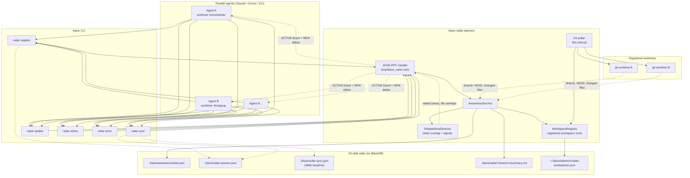
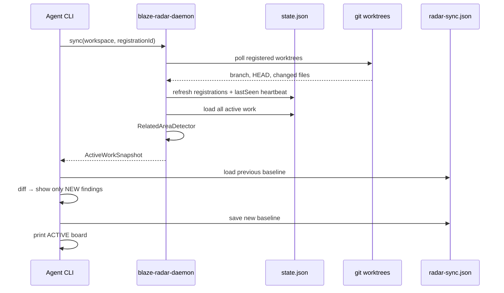

# Blaze Radar

**A shared awareness layer for parallel AI coding agents.**

When you run multiple Claude/Cursor agents across git worktrees, nobody knows what anyone else is doing. Blaze Radar is the team whiteboard — not a project manager, not a merge bot, not Skynet. Just observability so agents stop duplicating each other's investigations.

```
Engineer walks in  → checks the standup board
Engineer learns    → updates the board
Next engineer      → avoids redoing the same discovery
```

Extracted from [ProjectBlaze](https://github.com/Mikedan37/ProjectBlaze) as a standalone tool.

> **Why this repo is public**  
> Much of the surrounding Blaze stack (ProjectBlaze, AgentDaemon internals, BlazeDB integration paths, etc.) stays private due to IP. Blaze Radar is the **showable slice** — the awareness pattern and architecture, without proprietary agent runtime or database dependencies. You can adopt the approach here without access to the rest of the monorepo.

---

## What this is not

Blaze Radar does **not** make agents share a brain. It gives them the same situational awareness human engineers get from standups, PRs, and Slack.

People will misunderstand this. Blaze Radar is:

| It is | It is not |
|-------|-----------|
| A team whiteboard | A project manager |
| Situational awareness | A shared mind / hive consciousness |
| Pull-based observation | Push notifications or autopilot |
| "Look around before duplicating work" | Scheduling, assignment, or ownership claims |
| Awareness first | A merge train (that comes later, if the pain earns it) |

**The actual product metric:** Did Agent B learn what Agent A discovered *before* spending three hours on the same investigation?

The scheduler collision that motivated this wasn't a code-generation failure. Both agents wrote good code. The failure was that they didn't know they were coworkers. That's the bug Blaze Radar patches.

**Adoption reality:** Radar only works if agents actually use it. `blaze radar sync` needs to become muscle memory — every 15 minutes or before changing approach. If agents ignore it, you get that one Confluence page nobody has updated since 2019, but in Markdown.

**Longer term (not v1):** MCP integration could lower the "remember to run a shell command" problem — auto-register on session start, a tool call to check radar, auto-update on discoveries. Not because MCP is magically smarter, but because it removes friction. For now: awareness first, merge train second.

---

## The problem

Running 4–6 agents in parallel on one monorepo fails in predictable ways:

| Failure | What happens |
|---------|--------------|
| **Duplicate discovery** | Agent B spends 3 hours rediscovering what Agent A already found |
| **Concept collisions** | Same underlying system, different files — file-level locks don't help |
| **Tunnel vision** | Agent checks radar at T+0, pivots at T+30, never looks again |
| **Integration blindness** | Nobody knows what's landing on `main` (out of scope for v1) |

The human was the only shared memory. That doesn't scale.

---

## What Blaze Radar fixes

**Core invariant:** If Agent A learns something important, Agent B can discover it *before* duplicating the work.

Blaze Radar gives you:

- **Registration** — agents declare what they're solving and which worktree they're in
- **Living branch summaries** — mid-investigation learnings via `update`, not just at the end
- **Related-area warnings** — dumb-but-effective token overlap detects conceptual collisions
- **Git observation** — daemon independently polls registered worktrees (trust, but verify)
- **Sync checkpoints** — one command refreshes heartbeat, git state, and shows *only new findings* since your last sync

Fix "nobody knows what anyone is doing" first. Let the next pain earn its right to exist. See [What this is not](#what-this-is-not) for scope boundaries.

---

## Architecture



### Data flow (one `sync`)



| Module | Role |
|--------|------|
| `RadarCore` | Models, JSON store, awareness service, git observer, related-area detector |
| `RadarDaemon` | Background daemon + git poller |
| `RadarClient` | Unix socket client |
| `BlazeCLI` | `blaze radar` commands |

The daemon tracks registered workspace roots in `~/.blaze/daemon/radar-workspaces.json` and polls **only those worktrees** — no hardcoded repo paths.

### Storage: JSON files, not BlazeDB

**Blaze Radar does not use BlazeDB.** v1 persistence is plain JSON in your repo plus a small daemon index file. No database server, no BlazeBinary wire protocol, no cloud.

The private ProjectBlaze monorepo may integrate awareness with BlazeDB elsewhere; this extracted repo intentionally stays minimal so the pattern is portable and inspectable.

---

## Quick start

**Requirements:** macOS 14+, Swift 6+, git

```bash
git clone https://github.com/Mikedan37/blaze-radar.git
cd blaze-radar
swift build -c release
```

### 1. Start the daemon

```bash
.build/release/blaze-radar-daemon &
# listens on /tmp/blaze_radar.sock
```

### 2. Agent playbook

Copy `templates/CLAUDE.md` into your repo root (or add to your agent instructions):

```bash
# Before starting
blaze radar register "fix prompt scheduler"

# Every 15 minutes or before changing approach
blaze radar sync

# When you learn something
blaze radar update --found "missing attention arbiter — don't build another scheduler"

# When done
blaze radar done
```

### 3. Install the CLI (optional)

```bash
cp .build/release/blaze /usr/local/bin/blaze
# or symlink wherever your PATH looks
```

---

## Commands

| Command | Purpose |
|---------|---------|
| `blaze radar register "<task>"` | Declare what you're working on |
| `blaze radar sync` | Heartbeat + git refresh + delta findings + full board |
| `blaze radar active` | Show all active work (no delta) |
| `blaze radar update --found "..."` | Record mid-flight learnings |
| `blaze radar update --ruled-out "..."` | Record ruled-out hypotheses |
| `blaze radar done` | Mark your registration complete |

### Flags

```bash
blaze radar register "fix signup flow" \
  --workspace /path/to/monorepo \
  --worktree /path/to/worktree \
  --branch fix/signup \
  --agent claude-session-3
```

---

## How it works

### Persistence

All state lives in your repo — no cloud, no database:

```
your-repo/
  .blaze/
    awareness/state.json      # all registrations
    radar-session.json        # this CLI session's registration
    radar-sync.json           # last sync snapshot (for deltas)
    radar/<branch>/summary.md # human-readable branch notes
```

### Sync semantics

1. **First sync** — captures baseline. Full ACTIVE board shown; nothing marked as NEW.
2. **Later syncs** — compares against `.blaze/radar-sync.json`, shows only `+` prefixed deltas from other agents.
3. **Heartbeat** — bumps your `lastSeen` so the 30-minute stale reaper doesn't withdraw you mid-session.

### Related-area detection

No embeddings. Token intersection + domain signal words (`signup`, `attention`, `scheduler`, etc.) + file/path overlap. Intentionally dumb — fast, debuggable, good enough.

---

## Example: the test that matters

This is the scenario Blaze Radar was built for — not unit tests, but the *"two agents independently approach the same conceptual area"* test:

```bash
# Agent A (fix/prompt-scheduler worktree)
blaze radar register "fix prompt scheduler"
blaze radar update --found "Found: missing attention arbiter, don't build another scheduler"

# Agent B (fix/signup-interruptions worktree)  
blaze radar register "fix signup interruptions"
blaze radar sync    # sees A's finding on the board

# Agent B avoids building a second scheduler. Humanity survives another Tuesday.
```

### Sync delta proof

```bash
scripts/blaze-radar-sync-e2e.sh
```

This script proves:

1. Agent B's **baseline sync** sees Agent A's first finding in ACTIVE (not as a `+` delta)
2. After Agent A posts a **second** finding, Agent B's sync shows **only** the new one

```
PASS: baseline captured
PASS: finding one in ACTIVE
PASS: finding one not in NEW delta
PASS: only finding two is new
PASS: finding one not repeated
```

Unit tests (`swift test`) cover persistence, related-area detection, and sync heartbeat.

---

## Environment

| Variable | Default | Purpose |
|----------|---------|---------|
| `BLAZE_RADAR_SOCKET` | `/tmp/blaze_radar.sock` | Daemon socket path |

---

## Relationship to ProjectBlaze

Blaze Radar originated as the awareness layer inside ProjectBlaze's AgentDaemon. That parent project and related packages (including BlazeDB-backed paths) remain private due to IP. **This repo is the open, reduced version** you can read, run, and fork without the rest of the stack.

| | ProjectBlaze (private) | Blaze Radar (this repo) |
|--|------------------------|-------------------------|
| Persistence | May use BlazeDB + JSON | JSON files only |
| Wire protocol | BlazeBinary over AgentDaemon | JSON over Unix socket |
| Socket | `/tmp/blaze_agent.sock` | `/tmp/blaze_radar.sock` |
| Scope | Full agent runtime | Awareness layer only |
| Mental model | register, sync, update, done | Same |

You can run both side by side during migration.

---

## License

MIT — see [LICENSE](LICENSE).
